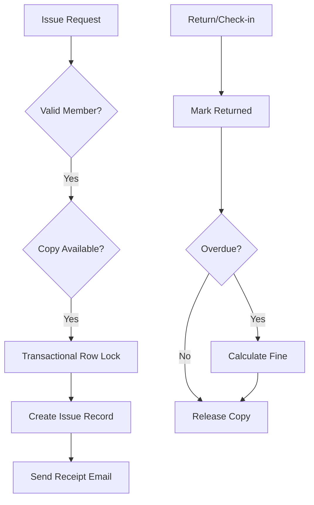

<div align="center">


# MPK Library System
### 📚 Professional School Library Management & Integrated Library System (ILS)

[](https://laravel.com)
[](https://vuejs.org)
[](https://inertiajs.com)
[](LICENSE)

**MPK Library System** is a high-performance, open-source **Library Management System** designed for schools, colleges, and small institutions. It provides a comprehensive **Integrated Library System (ILS)** experience that feels alive, featuring real-time circulation workflows and AI-driven insights.

[Explore Features](#-core-capabilities) • [Installation](#-quick-start) • [Developer](#-developed--maintained-by)

</div>

---

## 🌟 Why This Project?

Most library apps are either too basic for the complex reality of a busy circulation desk or far too heavy for small teams to manage. MPK Library System hits the "Golden Middle":

- **Operational Reality**: Built for librarians who need fast accession-level copy tracking.
- **Modern Stack**: Leverages the power of **Laravel 13** and **Vue 3 (Inertia)** for a seamless SPA experience.
- **Fast Performance**: Optimized for busy school periods and live service counters.

---

## 🚀 Core Capabilities

| Feature | Description |
| :--- | :--- |
| **📈 Dynamic Dashboard** | Real-time KPIs, trend charts, and AI-driven strategic insight cards. |
| **📖 Catalog Management** | Comprehensive book cataloging with precise accession-level copy tracking. |
| **👥 Member Portal** | Dedicated self-service portal for students, teachers, and staff. |
| **⚡ Issue Desk** | Fast, search-optimized POS issue flow with transactional integrity. |
| **💸 Fine Management** | Automated overdue calculation with paid/waived auditing. |
| **📑 PDF Reporting** | Professional exports for overdue lists, inventory summaries, and AI strategy tips. |

---

## ⚙️ Tech Arsenal

<div align="center">

### Backend


### Frontend


</div>

---

## 🔄 Circulation Workflow

Understanding how books move through the system:



---

## 🏁 Quick Start

### 1️⃣ Project Setup
Install all dependencies and prepare the environment automatically:
```bash
composer run setup
```
> [!NOTE]
> This command handles `composer install`, `.env` creation, `key:generate`, `migrate`, `npm install`, and `npm run build`.

### 2️⃣ Seed Data (Optional)
Populate your database with sample books and members:
```bash
php artisan db:seed
```

### 3️⃣ Start Development
Run the server and frontend compiler simultaneously:
```bash
composer run dev
```

---

## 👨‍💻 Developed & Maintained By

<div align="center">

<!-- Animated Header -->


<!-- Animated Typing -->
<a href="https://git.io/typing-svg"></a>

<p>
  <a href="https://mahimapaseda.vercel.app/"></a>
  <a href="https://www.linkedin.com/in/mahimapaseda"></a>
  <a href="https://www.youtube.com/@mahimapaseda"></a>
  <a href="https://www.instagram.com/mahi_pase_2002"></a>
</p>

</div>

```javascript
const mahima = {
    title: "Full-Stack Developer & Creative Technologist",
    location: "Colombo, Sri Lanka 🇱🇰",
    education: "BSc (Hons) Computer Science @ SLIIT City UNI",
    currentRole: "Web Developer @ Delta Gemunupura College",
    passions: ["Clean Code", "Innovation", "Problem Solving"],
    lifePhilosophy: "Code with purpose. Design with passion. Build with vision.",
    techStack: ["Laravel", "Vue 3", "Node.js", "Java", "Kotlin", "Cloud Architectures"]
};
```

---

## 📈 SEO & Discovery (GEO)

*Keywords: Library Management System, Open Source Library Software, Laravel Library App, Vue.js Integrated Library System, School Library Management System, ILS, Automated Circulation, Book Inventory Management, Library Cataloging Software.*

*Target Platforms: Schools, Colleges, Technical Institutes, Small Public Libraries.*

**⭐ If you like this project, please consider giving it a star! ⭐**

---
<div align="center">

</div>
