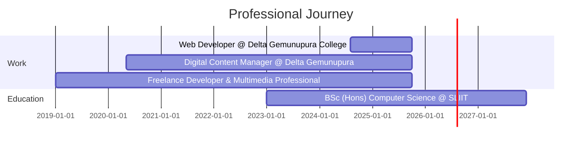

# MPK Library System - Open Source Library Management Software

### Professional School Library Management & Integrated Library System (ILS)

**MPK Library System** is a high-performance, open-source **Library Management System** built with **Laravel 13**, **Inertia.js**, and **Vue 3**. Designed specifically for schools, colleges, and small institutions, it provides a comprehensive **Integrated Library System (ILS)** experience that feels alive and operationally practical.

Whether you are looking for an **automated circulation management** tool or a complete **book inventory system**, MPK Library System delivers real circulation workflows: accession-level copies, fast issue/return operations, incident handling, fines, role-aware access, member self-service, and AI-driven analytics.

## Why This Project Exists

Most library apps are either too basic for day-to-day desk reality or too heavy for small teams.

This project aims for the middle path:

- operationally practical for librarians
- technically maintainable for developers
- fast enough for live counters and busy school periods

## At A Glance

| Layer | Technology |
| --- | --- |
| Backend | Laravel 13, PHP 8.3+ |
| Frontend | Vue 3, Inertia.js, Vite 6, Tailwind CSS 4 |
| Database | SQLite default (MySQL/PostgreSQL supported by configuration) |
| Reports | barryvdh/laravel-dompdf |
| Notifications | Laravel Notifications (mail channel) |

## Core Capabilities

- Dashboard with cached KPIs, trend charts, and AI insight cards
- Book catalog + accession-level copy tracking
- Member management for student, teacher, and staff types
- Issue desk and POS issue flow with search endpoints
- Return handling with overdue fine calculation
- Lost and damaged incident workflows with optional charges
- Fine administration with paid and waived states + resolver audit trail
- Member portal with separate guard for personal loan history and fines
- PDF exports: overdue, inventory summary, incidents, AI strategy
- Daily reminder command: library:send-notifications

## Role Map

Authorization is handled through user.role and custom middleware.

- librarian: full access to books, categories, members, issues, fines, settings, and reports
- teacher: issue and report access
- principal: report access
- member guard: separate login context for the member portal

## Architecture Snapshot

This is a server-driven SPA using Inertia, so you get modern frontend UX without introducing a separate public API surface.

Business logic is organized in service classes:

- BookInventoryService: copy lifecycle, stock alignment, and accession handling
- LibraryNotificationService: issue/return receipts and reminder automation
- AiInsightsService: dashboard strategy insights and alert heuristics

Key domain entities:

- Book
- BookCopy
- BookIssue
- Fine
- Member
- Setting

Audit trail support:

- LogsActivity trait
- ActivityLog records (model changes and action metadata)

## Data Model Highlights

- books: title metadata + aggregate stock fields
- book_copies: accession_number, sequence_number, status, rack location
- book_issues: links member/book/copy with issue lifecycle fields
- fines: unpaid/paid/waived with resolution metadata
- members: member identity + portal credentials
- users: staff login + role
- settings: runtime policy values, cached through SettingCache
- activity_logs: action history for key model operations

## Circulation Logic (Simplified)

Issue flow

1. Validate member and policy constraints.
2. Reserve the next available copy with row lock.
3. Create the issue record.
4. Send issue receipt after transaction commit.

Return flow

1. Mark issue returned and release copy.
2. Compute overdue days with grace-period settings.
3. Create or update fine when chargeable.
4. Send return receipt after commit.

Lost or damaged flow

1. Close issue with incident status.
2. Mark copy as lost or damaged.
3. Create or update charge when needed.

## Quick Start & Installation

To get the system running locally for development or testing, follow these steps.

### 1) Automated Project Setup

The fastest way to install all dependencies, generate keys, and run migrations is using the built-in setup command:

```bash
composer run setup
```

**What this does under the hood:**
- Installs PHP/Composer dependencies
- Creates `.env` from `.env.example`
- Generates `APP_KEY`
- Runs database migrations (SQLite by default)
- Installs npm packages
- Builds optimized frontend assets

### 2) Seed Sample Data (Optional)

If you want to test the system with pre-populated books, members, and issues:

```bash
php artisan db:seed
```

### 3) Run the Application

To start the development server and the frontend compiler simultaneously:

```bash
composer run dev
```

The site will be accessible at:
- **Backend/App**: [http://127.0.0.1:8000](http://127.0.0.1:8000)
- **Vite (Frontend)**: [http://localhost:5173](http://localhost:5173)

### Windows Users
You can also use the included PowerShell helper to handle everything in one go:
```powershell
.\Run-Site.ps1 -Setup -Seed
```

## Default Admin Login

After seeding:

- Email: admin@school.lk
- Password: password

## Scheduler and Notifications

Notification types:

- issue receipt emails
- return receipt emails
- due reminder emails
- overdue alerts

Scheduled command:

- library:send-notifications
- scheduled daily at 08:00

Production cron:

```bash
* * * * * php /path/to/artisan schedule:run >> /dev/null 2>&1
```

## Testing

Current feature test focus areas:

- issue condition workflow (lost and damaged)
- fine administration (paid and waived)
- reminder and overdue notification behavior

Run tests:

```bash
php artisan test
```

## Technical Review (April 2026)

Strengths

- service-oriented domain logic keeps controllers focused
- accession-level copy tracking matches real library operations
- transactional and lock-based issue flow improves consistency
- clear role segmentation including separate member guard
- useful operational reporting and scheduled automations
- integrated activity logging for traceability

Known gaps

- monthly dashboard grouping uses SQLite-specific strftime semantics
- spatie/laravel-permission is installed but custom role middleware is used for route control
- seeded member data does not consistently include portal credentials
- cache invalidation relies on manual controller-level forget calls
- notifications run synchronously unless queue infrastructure is enabled

Suggested next upgrades

1. make date aggregation database-agnostic
2. consolidate RBAC strategy around one approach
3. expand authorization tests per role and route group
4. move notifications to queued delivery for larger deployments
5. centralize cache invalidation via domain events/listeners

## License

MIT

---

## SEO & Discovery (GEO)

*Keywords: Library Management System, Open Source Library Software, Laravel Library App, Vue.js Integrated Library System, School Library Management System, ILS, Automated Circulation, Book Inventory Management, Library Cataloging Software.*

*Target Platforms: Schools, Colleges, Technical Institutes, Small Public Libraries.*

---

<div align="center">

## 👨‍💻 Developed & Maintained By

<!-- Animated Header -->


<!-- Animated Typing -->
<a href="https://git.io/typing-svg"></a>

<p>
  <a href="https://mahimapaseda.vercel.app/"></a>
  <a href="https://www.linkedin.com/in/mahimapaseda"></a>
  <a href="https://www.youtube.com/@mahimapaseda"></a>
  <a href="https://www.instagram.com/mahi_pase_2002"></a>
</p>

</div>

### 🎯 About Me

```javascript
const mahima = {
    title: "Full-Stack Developer & Creative Technologist",
    location: "Colombo, Sri Lanka 🇱🇰",
    education: "BSc (Hons) Computer Science @ SLIIT City UNI",
    currentRole: "Web Developer @ Delta Gemunupura College",
    passions: ["Clean Code", "Innovation", "Problem Solving"],
    lifePhilosophy: "Code with purpose. Design with passion. Build with vision.",
    
    techStack: {
        frontend: ["HTML5", "CSS3", "JavaScript", "React", "Bootstrap", "SASS"],
        backend: ["Java", "Node.js", "Express.js", "PHP"],
        databases: ["MySQL", "MongoDB", "Firebase"],
        tools: ["Git", "VS Code", "Android Studio", "Google Cloud"],
        languages: ["Java", "JavaScript", "Kotlin", "C++", "SQL"]
    },
    
    currentlyLearning: ["Cloud Technologies", "Software Architecture", "Best Practices"],
    funFact: "I turn coffee into code and ideas into reality! ☕➡️💻"
};
```

<details>
<summary><b>🛠️ Full Tech Arsenal</b></summary>
<br/>

**Frontend:** `HTML5` `CSS3` `JavaScript` `React` `Bootstrap` `SASS`  
**Backend:** `Java` `Node.js` `Express.js` `PHP`  
**Databases:** `MySQL` `MongoDB` `Firebase`  
**Languages:** `Java` `Kotlin` `C++` `SQL`

</details>

### 💼 Experience Timeline



<div align="center">

### 📫 Let's Connect!

<a href="mailto:mahimapasedakusumsiri@gmail.com">

</a>

---


**⭐ If you like my work, consider giving a star to my repositories! ⭐**

</div>
